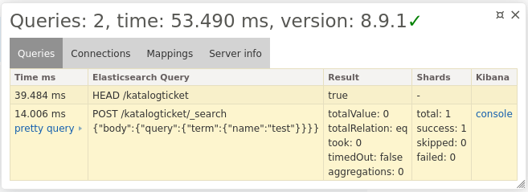

# Elasticsearch Extension
Elasticsearch Nette extension pro balíček https://github.com/ebrana/elasticsearch.

### Instalace
````
composer require ebrana/elasticsearch-extension
````

#### Konfigurace

````
elasticsearch:
    profiling: true
    indexPrefix: "katalog_"
    # cache je nepovinné (adapters: https://doc.nette.org/cs/caching#toc-uloziste)
    cache: 'cache.system'
    # tato sekce může být vynechána, protože attributes je default driver
    #    driver:
    #        type: "attributes" # attributes nebo json
    #        keyResolver: Elasticsearch\Bundle\KeyResolver # resolvuje klíče typu nested nebo object
    mappings:
        - App\Entity\Elasticsearch\Product
    connection:
        hosts:
            - '%env(resolve:ELASTICSEARCH_URL)%'
        username: ""
        password: ""
        cloudId: ""
        retries: 10
        elasticMetaHeader: true/false
        logger: "@logger" #Psr\Log\LoggerInterface
        httpClient: ... #Psr\Http\Client\ClientInterface
        asyncHttpClient: ... #Http\Client\HttpAsyncClient
        nodePool: ... #Elastic\Transport\NodePool\NodePoolInterface
        httpClientOptions: ... # podle http clienta
        api:
            apiKey: ""
            id: ""
        ssl:
            sslVerification: true/false
            sslCA: ""
            sslCert:
                cert: ""
                password: ""
            sslKey:
                key: ""
                password: ""
        
````

#### Tracy

